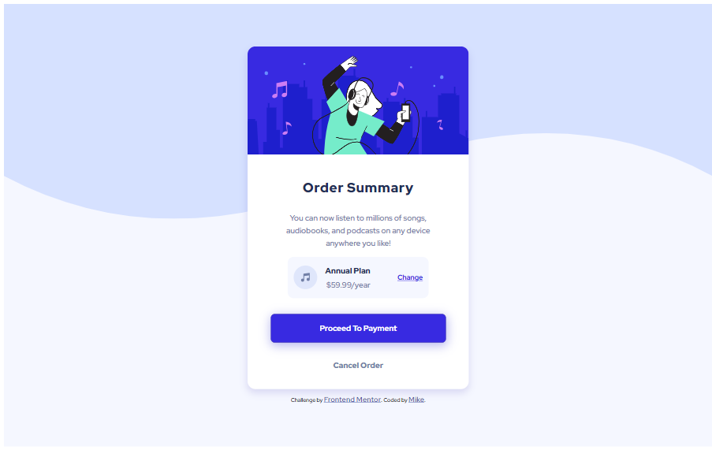

# Frontend Mentor - Order summary card solution

This is a solution to the [Order summary card challenge on Frontend Mentor](https://www.frontendmentor.io/challenges/order-summary-component-QlPmajDUj). Frontend Mentor challenges help you improve your coding skills by building realistic projects. 

## Table of contents

- [Overview](#overview)
  - [The challenge](#the-challenge)
  - [Screenshot](#screenshot)
  - [Links](#links)
- [My process](#my-process)
  - [Built with](#built-with)
  - [Useful resources](#useful-resources)
- [Author](#author)
- [Acknowledgments](#acknowledgments)

**Note: Delete this note and update the table of contents based on what sections you keep.**

## Overview
This an order summary card component. Users can easily see and interact with the buttons—they change when you hover over them. I used HTML and CSS to create the layout and style, making sure it has good aesthetics. The goal was to keep it simple and user-friendly.

### The challenge

Users should be able to:

- See hover states for interactive elements

### Screenshot

### Links

- Solution URL: [My solution URL here](https://github.com/sanyomor-01/order-summary-component-main)
- Live Site URL: [The  live site URL here](https://order-summary-component-main-git-master-sanyomor-01.vercel.app/)

## My process
- Redesgned the component basing the provides designs
- HTML structer. Used semantic tags to layout the component structure
- CSS styling. Then the component to give it the a nice visual look

### Built with

- Semantic HTML5 markup
- CSS custom properties
- Flexbox
- CSS Grid
- Mobile-first workflow

## Author

- Website - [Michael Sanyomor](https://github.com/sanyomor-01)
- Frontend Mentor - [@sanyomor-01](https://www.frontendmentor.io/profile/sanyomor-01)
- Twitter - [@sanyo_mor](https://www.twitter.com/sanyo_mor)

## Acknowledgments

Thanks very much Mike...Keep it up
